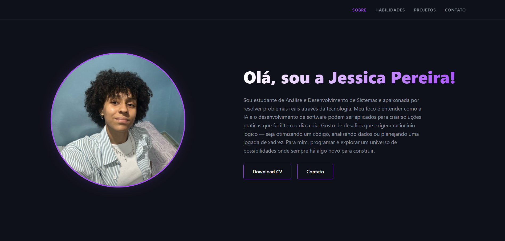

# 🌌 Portfólio Pessoal — Jessica Pereira

Bem-vindo ao repositório do meu portfólio! Este projeto foi desenvolvido para centralizar meus principais projetos em tecnologia e Inteligência Artificial, servindo como uma vitrine das minhas habilidades em desenvolvimento de software e análise de dados.

## 🚀 Sobre o Projeto
O objetivo deste site é apresentar minha trajetória como estudante de ADS na FIAP e desenvolvedora, destacando projetos práticos onde aplico o conceito de **"aprender fazendo"**. O design é focado em uma experiência moderna (Dark Mode), responsiva e com navegação fluida.

## 🛠️ Tecnologias Utilizadas
Para a construção deste portfólio, utilizei:
* **HTML5:** Estruturação semântica do conteúdo.
* **CSS3:** Estilização personalizada, uso de variáveis, Flexbox e Grid para responsividade.
* **FontAwesome:** Ícones para as seções de habilidades e contatos.

## 📂 Organização do Repositório
* `index.html`: Arquivo principal com toda a estrutura do site.
* `style.css`: Arquivo com todas as regras de design e responsividade.
* `assets/`: Pasta contendo imagens dos projetos, foto de perfil e o arquivo do currículo em PDF.

## 📌 Seções Principais
1. **Sobre:** Uma breve introdução sobre mim, meus interesses em IA, Astronomia e Xadrez.
2. **Habilidades:** Destaque para Python, SQL, IA & ML e Power BI.
3. **Projetos:** Galeria de projetos selecionados (IA, Data Science e Web), com links diretos para seus respectivos repositórios.
4. **Contato:** Links rápidos para e-mail, LinkedIn e GitHub.

## 🌐 Deploy
O site está hospedado na **Vercel** e pode ser acessado através do link abaixo:  
> [🔗 Acesse meu Portfólio aqui](https://jessiepsx.vercel.app) 

---
*Onde cada linha de código é um movimento estratégico em um universo de possibilidades. 🌌♟️*
